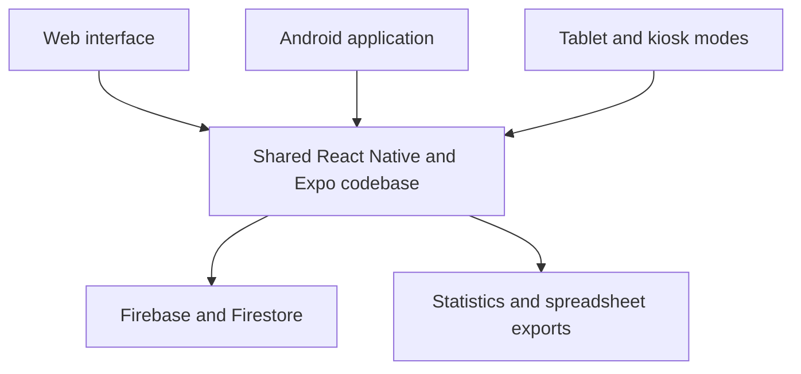

# Community Attendance & Analytics Platform

> **Project showcase:** The source code is maintained privately because the application supports real community operations and processes attendance-related information. This repository contains project documentation only.

A role-based web and Android platform for managing attendance, prayers, and event programs across multiple community locations.

Developed as an independent volunteer software project using a shared React Native and Expo codebase with Firebase and Firestore.

## Project Overview

The platform replaces fragmented manual attendance workflows with a unified digital system. It supports multiple operational contexts, including individual registration, program administration, tablet-based data entry, and unattended kiosk use.

Locations, organizational groups, user permissions, and event types can be configured independently. Each application mode provides only the functionality required for its workflow while using the same underlying data structure.

## Key Features

| Area | Capabilities |
|---|---|
| Attendance management | Records attendance for prayers, programs, and other events |
| Multiple capture modes | QR-based registration, tablet operation, terminals, and cloud-synchronized entry |
| Role-based access | Separate permissions and interfaces for administrators, local operators, and restricted users |
| Multi-location support | Independently configurable locations and organizational groups |
| Guest registration | Registration of external participants with required information validation |
| Live analytics | Real-time statistics and attendance summaries by program, location, and group |
| Search and filtering | Searchable master views with program, prayer, location, and attendance filters |
| Data export | Structured spreadsheet exports for reporting and further analysis |
| Kiosk operation | Device-specific and global reset behavior for shared terminals |
| Access protection | Authentication, role checks, CAPTCHA validation, and workflow-specific restrictions |

## System Architecture

The shared application layer keeps business rules and user experience consistent across web, Android, tablet, and kiosk environments. Firestore provides synchronized data access, while application-level permissions control the operations available to each user.

## Technology Stack

| Category | Technologies |
|---|---|
| Application | React Native, Expo, React Native Web, JavaScript |
| Data and backend | Firebase, Firestore |
| Hosting and delivery | Firebase Hosting, Expo Application Services |
| Local storage and exports | AsyncStorage, Expo FileSystem, Sharing, XLSX |
| Development workflow | Git, GitHub, VS Code, Linux/WSL |

## Engineering Focus

### Real-Time Data with Controlled Database Usage

The application requires current attendance information across several interfaces. Its data flow was refined to preserve live updates while reducing unnecessary Firestore reads and avoiding duplicate subscriptions across application modes.

### Consistent Permissions and Configuration

Available programs, organizational groups, statistics, and administrative functions depend on the active user, location, and application mode. Reusable configuration and validation keep these rules consistent across registration, administration, analytics, and exports.

### Reliable Shared-Device Workflows

Tablet and kiosk environments require predictable behavior after every registration. Device-level and global reset options, protected administration paths, and separated application modes reduce the risk of stale sessions or unintended access.

### Accurate Reporting

Dashboard values, detailed views, and spreadsheet exports must apply the same filters and inclusion rules. These workflows were iteratively tested and aligned to keep displayed statistics and exported records consistent.

## My Contribution

I independently designed and developed the application as a volunteer project, from requirements analysis and data modeling to implementation, testing, optimization, and deployment.

My responsibilities included:

- Translating real operational workflows into technical requirements
- Designing the shared web and Android application structure
- Implementing role-based interfaces and access rules
- Developing attendance, event, statistics, filtering, and export workflows
- Integrating Firebase and Firestore
- Testing desktop, mobile, tablet, and kiosk workflows
- Debugging, refactoring, performance optimization, and deployment

## Development Approach

AI-assisted workflows support the development process. I define the requirements and expected behavior, review implementation proposals, test changes against real workflows, identify regressions and edge cases, and guide the application through iterative refinement.

Functional validation, architectural decisions, and acceptance of changes remain part of my responsibility.

## Privacy and Source Availability

The source code, production configuration, and operational data are intentionally not public.

This repository does not contain:

- Application source code or environment configuration
- API credentials or Firebase configuration
- Real names, attendance records, or organizational identifiers
- Internal URLs, authentication details, or usable QR codes

Any screenshots published in this showcase will contain anonymized or synthetic data.

## Project Status

This is an ongoing volunteer project that is maintained and refined as operational requirements evolve.

## Contact

[LinkedIn](https://www.linkedin.com/in/tehmoor-bhatti) · [GitHub](https://github.com/Tehmoor23)
