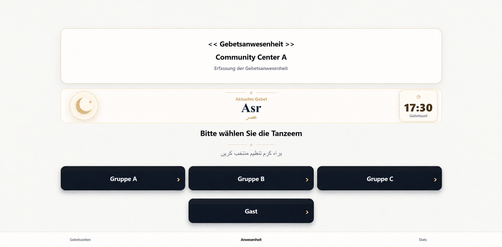
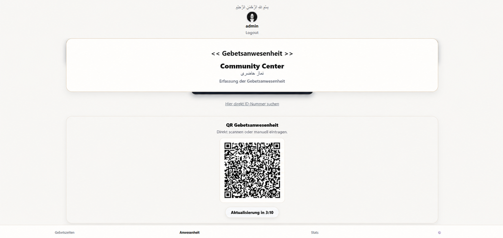
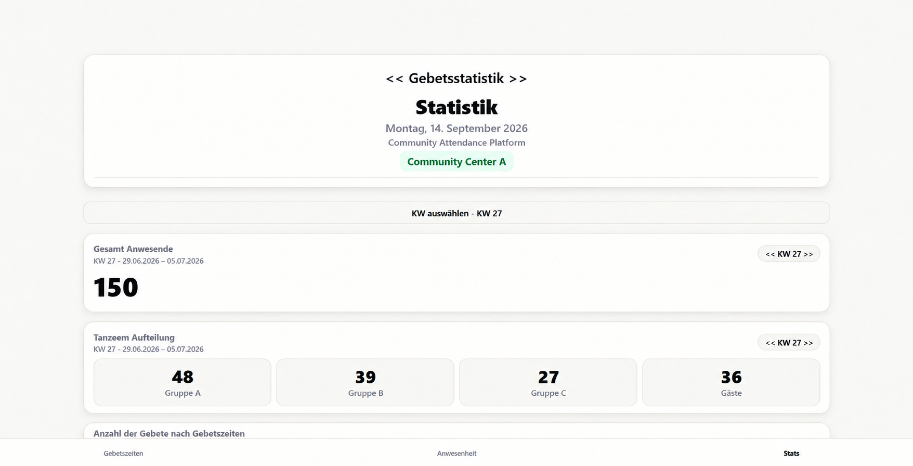
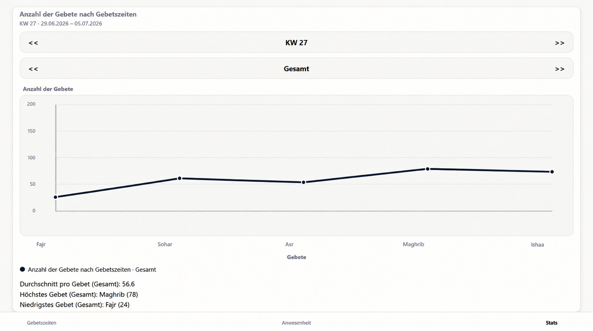
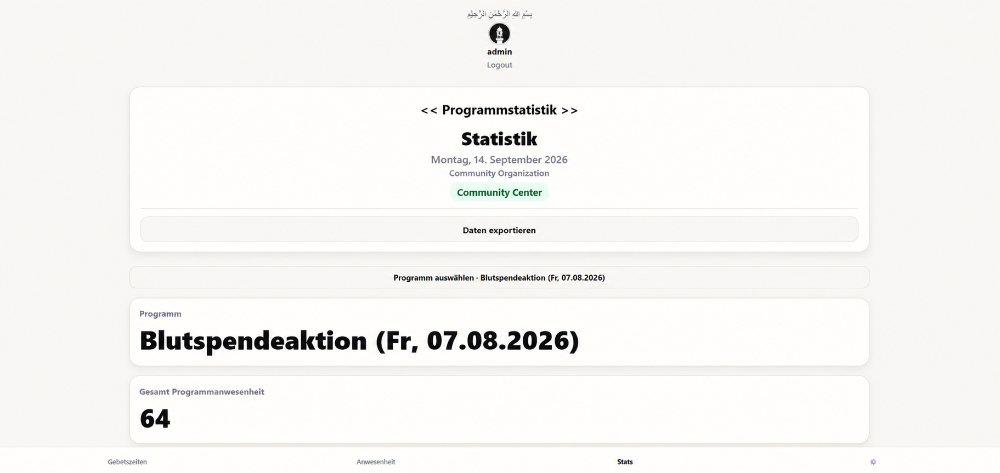
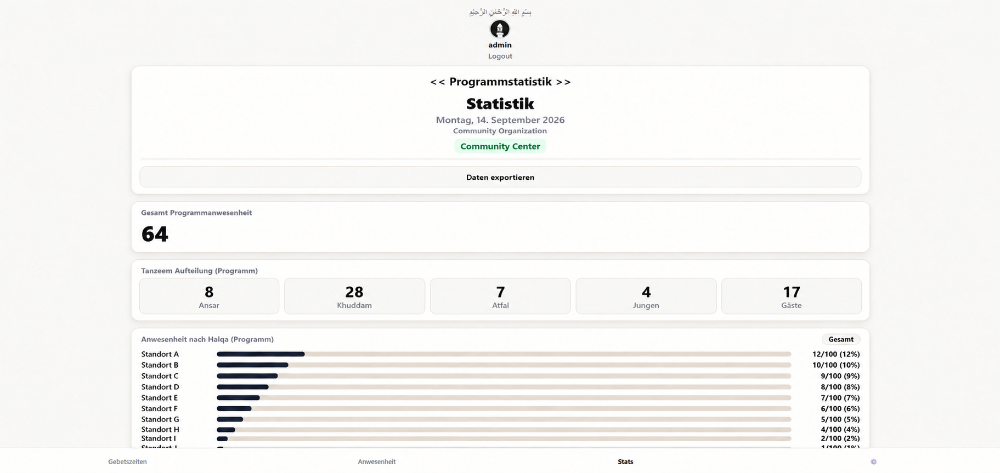

# Community Attendance & Analytics Platform

**Web & Android Application | Attendance Management | Data Analytics**

*Independent volunteer software project — source code maintained privately*

A role-based web and Android platform for managing attendance across prayers, community programs, and events at multiple locations.

I designed and developed the application to replace fragmented manual attendance processes with a unified digital system. The platform combines different operational workflows within a shared React Native, Expo, and Firebase codebase.

## Core Features

- Attendance management for prayers, programs, and community events
- Manual, QR-based, tablet, terminal, and cloud-synchronized workflows
- Role-based access control and separate interfaces for different users
- Independent configuration of multiple locations and organizational groups
- Real-time statistics, dashboards, filters, and visual evaluations
- Program-specific attendance tracking and analysis
- Structured data exports for reporting and further processing
- Responsive interfaces for desktop, tablet, Android, and kiosk devices
- Centralized cloud storage using Firebase and Firestore

## Selected Screenshots

The following screenshots provide a selected insight into the platform and its main operational workflows.

They represent only a small part of the complete application. The platform also includes additional administrative, configuration, filtering, user-management, master-data, export, and role-specific functionality that is intentionally not shown publicly.

All displayed locations, identifiers, and statistics have been anonymized or replaced with synthetic demonstration data. The QR code shown was temporary and is no longer active.

### Attendance Entry

*Tablet and terminal attendance workflow*

The interface displays the currently active prayer and provides separate registration paths for different organizational groups. It is optimized for quick use on larger touch-enabled devices.

### QR-Based Attendance

*Temporary QR workflow with manual ID lookup*

The platform can generate temporary QR codes for attendance registration. A direct ID search is available as an alternative when QR registration is not suitable.

### Attendance Analytics

*Weekly overview with group-based statistics*

Administrators can review aggregated attendance figures for a selected calendar week and location. The overview provides a concise breakdown across the configured organizational groups.

### Attendance Distribution

*Visual evaluation and summary metrics*

Attendance can be evaluated across individual prayers using charts and summary statistics. The application calculates averages and highlights the highest and lowest attendance values within the selected period.

### Program Analytics

*Independent evaluation of programs and community events*

Programs can be tracked separately from regular prayer attendance. Administrators can select an event, review its total attendance, apply filters, and export the associated records.

### Location Breakdown

*Comparison across groups and participating locations*

The detailed program view combines group distributions, location-based attendance, reference totals, percentages, and visual progress indicators.

## Technical Stack

- **Application:** React Native, Expo, JavaScript
- **Platforms:** Web and Android
- **Backend:** Firebase and Firestore
- **Data:** Shared cloud-based data structure for users, locations, attendance records, prayers, and programs
- **Access Control:** Role-based permissions and application modes
- **Development:** Git, GitHub, testing, debugging, refactoring, and deployment

## Development & Responsibilities

I independently designed and developed the platform as a volunteer software project.

My responsibilities included:

- Translating practical requirements into technical workflows
- Designing the application structure and user interfaces
- Implementing the web and Android application
- Creating the Firestore data model and cloud integration
- Developing role-based access and administrative functionality
- Implementing QR, tablet, terminal, and manual attendance workflows
- Building statistics, dashboards, filters, and export functionality
- Optimizing Firestore usage while maintaining current information
- Testing, debugging, refactoring, and deploying the application
- Iteratively improving the system based on practical use and feedback

## Source Code & Privacy

The production source code is intentionally not included in this public repository because the application supports real operational processes and may interact with confidential attendance and configuration data.

This repository contains only project documentation and anonymized screenshots. It does not contain personal attendance records, active credentials, API keys, Firebase configuration, or internal access information.

Further technical details can be discussed upon request without disclosing confidential data or production credentials.

## Current Status

The platform is under active development and supports practical community attendance and program-management workflows.

## Contact

[LinkedIn](https://www.linkedin.com/in/tehmoor-bhatti) · [Email](mailto:tehmoor.bhatti@stud.fra-uas.de)
